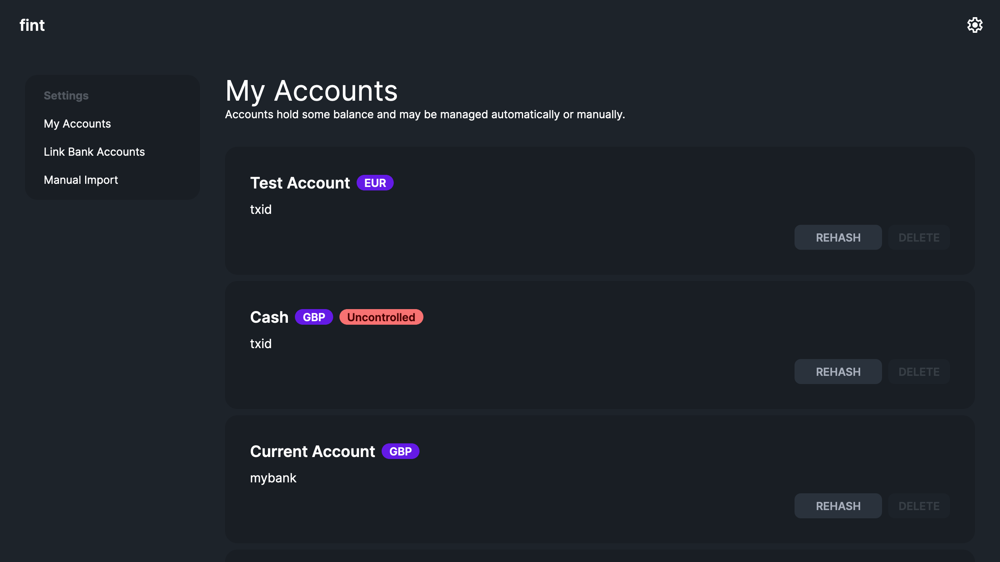
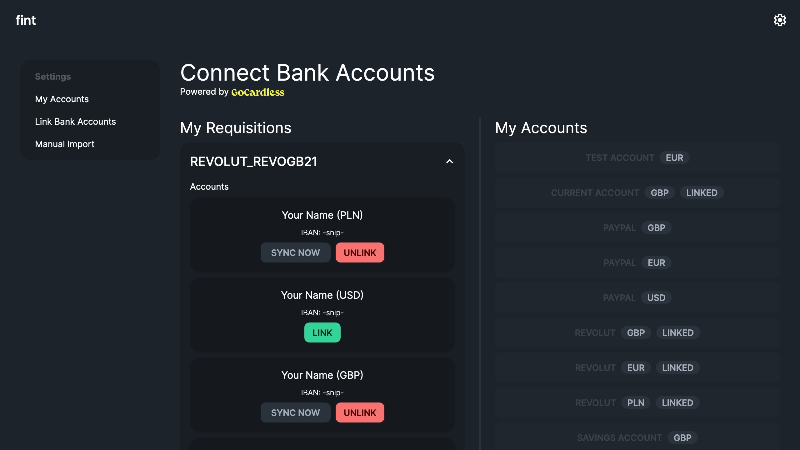
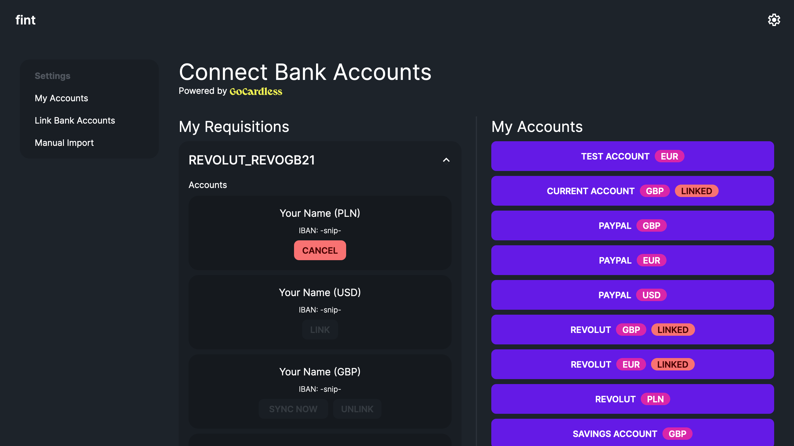
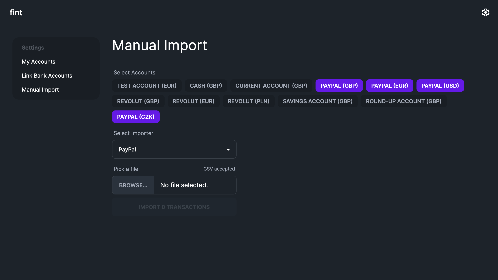
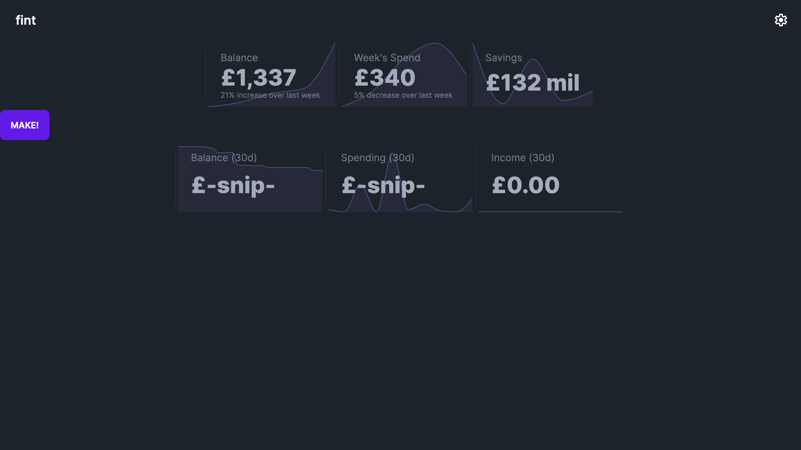

# fint

**fint** is a tool for exporting transactions from financial institutions through [GoCardless](https://gocardless.com/) into a [Mongo](https://www.mongodb.com/) database.

fint was originally going to be the be-all and end-all personal finance application for myself before I found out how much of a pain banks and other financial institutions are to deal with. My personal favourite being when my bank decided to change the date format in CSV exports from "14/03/2023" to "14th Mar 2023".

This project is accompanied by the [UFF Project](https://git.is.horse/izzy/uff-project) which untangles all of this data and normalises it into a sensible common format, hence removing the reliance on this project if needs be (e.g. it becomes too unwieldy to maintain, GoCardless shuts down / it's easier to do manual imports at that point, etc).

## Tech Stack

This is a pretty straightforward project:

- Daisy UI
- Tailwind
- Next.js
- Typescript
- MongoDB

## Screenshots

<em>Account overview</em>
 

<em>Connect bank accounts</em>
 

<em>Linking UI</em>
 

<em>Manual CSV importing</em>
 

<em>Some preliminary work towards data visualisation</em>
 

